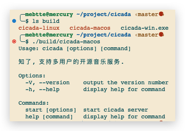

# Build

## Preparation

- [Node.js](https://nodejs.org) >= 18

## How to build

Pull the repository:

```sh
git clone https://github.com/mebtte/cicada.git
```

Enter the work directory and install packages:
```sh
cd cicada && npm ci
```

build:

```sh
npm run build:current
```

You can find three executable binaries on `build` directory, only the one with current platform is working. For example, when building on Apple silicon macOS, only `cicada-macos` is working, the rest `cicada-linux` / `cicada-win.exe` can be run even you copy to linux or windows.



