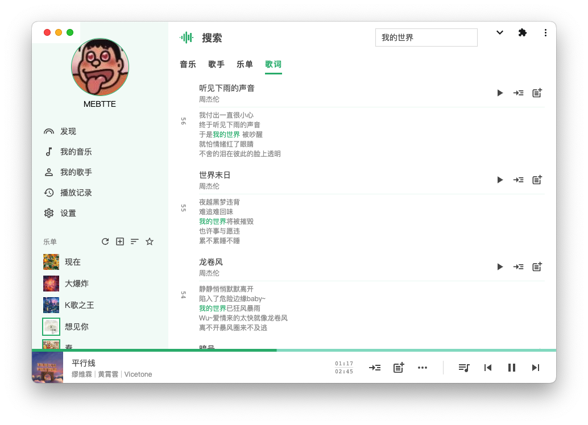

# 知了

知了, 支持多用户的开源音乐服务.




## 特色

- 支持多用户
- 支持 [PWA](https://developer.mozilla.org/docs/Web/Progressive_web_apps)
- UI 支持桌面端和移动端
- 系统媒体和快捷键支持
- 音乐支持标准音质/超高音质/伴奏以及多份歌词
- 回收站支持, 恢复误删数据
- 乐单/播放列表/播放队列音乐数量无限制

## 准备

- **[邮件发送服务](https://zh.wikipedia.org/wiki/%E7%AE%80%E5%8D%95%E9%82%AE%E4%BB%B6%E4%BC%A0%E8%BE%93%E5%8D%8F%E8%AE%AE)**, 知了使用邮箱验证码进行登录以及部分功能依赖邮箱实现, 第三方邮件发送服务可以参考 [网易邮箱](https://note.youdao.com/ynoteshare/index.html?id=f9fef46114fb922b45460f4f55d96853) / [QQ 邮箱](https://service.mail.qq.com/cgi-bin/help?subtype=1&id=28&no=1001256) / [Outlook 邮箱](https://support.microsoft.com/zh-cn/office/pop-imap-%E5%92%8C-smtp-%E8%AE%BE%E7%BD%AE-8361e398-8af4-4e97-b147-6c6c4ac95353)
- **[FFmpeg](https://ffmpeg.org)**[可选], 知了会自动检测 `PATH` 下是否有 ffmpeg, 有的话会调用 ffmpeg 进行音频压缩(无损音质不会进行压缩), 没有的话将不会进行音频压缩

> 使用邮箱验证码登录可以极大地提高安全性, 相比账号密码的登录方式, 邮箱验证码登录可以避免被暴力破解

## 部署

新建配置文件 `config.json`:

```json
{
  "emailHost": "smtp.example.com",
  "emailUser": "example",
  "emailPass": "example-password"
}
```

> 完整配置可以参看[配置项](./docs/config/index.md), 支持 JSON/[JSON5](https://json5.org) 语法.

在 [Releases](https://github.com/mebtte/cicada/releases) 下载并解压对应平台的二进制包, 通过下面命令指定配置文件并启动(以 x64 Linux 为例):

```sh
./cicada-linux-x64 start -c config.json
```

通过 `localhost:8000` 或者 `{{ip}}:8000` 访问知了服务. 目前只提供了几种主流平台的构建包, 其他平台可以参考[构建文档](./docs/build/index.md)自行构建.

### Docker

知了支持 Docker 镜像部署:

```sh
docker run \
  -d \
  --restart=always \
  -p 8000:80 \
  -v $HOME/cicada-data:/data \
  -v $HOME/cicada-config.json:/config.json \
  --name cicada \
  mebtte/cicada
```

需要注意的是, 使用 Docker 镜像首次运行必须配置 [initialAdminEmail](./docs/config/index.md#initialadminemail), 否则无法完成初始化. 此外在 Docker 镜像下 [data](./docs/config/index.md#data) 和 [port](./docs/config/index.md#port) 配置项不会生效.

## 版本升级

[从 0.x.x 升级到 1.x.x](./docs/version_update/index.md)

## 常见问题

<details>
  <summary>如何迁移数据 ?</summary>

知了所有数据都位于 `{{base}}` 目录下, 将 `{{base}}` 目录复制或者移动即可完成迁移.

</details>

<details>
  <summary>如何安装 PWA ?</summary>

[PWA](https://developer.mozilla.org/docs/Web/Progressive_web_apps) 仅支持 `HTTPS` 或者 `localhost`, 知了目前暂不支持配置 `HTTPS`, 请使用 `nginx` 之类的工具进行 `HTTPS` 反向代理. Chrome 下安装方法请查看[教程](https://support.google.com/chrome/answer/9658361?hl=en&co=GENIE.Platform%3DDesktop).

</details>

<details>
  <summary>在 iOS/iPadOS 上处于后台无法自动播放下一首 ?</summary>

这是因为 Safari 会暂停处于后台页面的 JavaScript, 知了现在无法解决这个问题, 需要等待 Safari 对 PWA 的支持.

</details>

<details>
  <summary>Windows 下安装 PWA 后的图标偏小 ?</summary>

这是因为 Windows 和 macOS 的图标占用空间不一致, PWA 无法同时兼容, 知了使用的是 macOS 图标尺寸.

</details>

## 开源协议

[GPL](./license)
