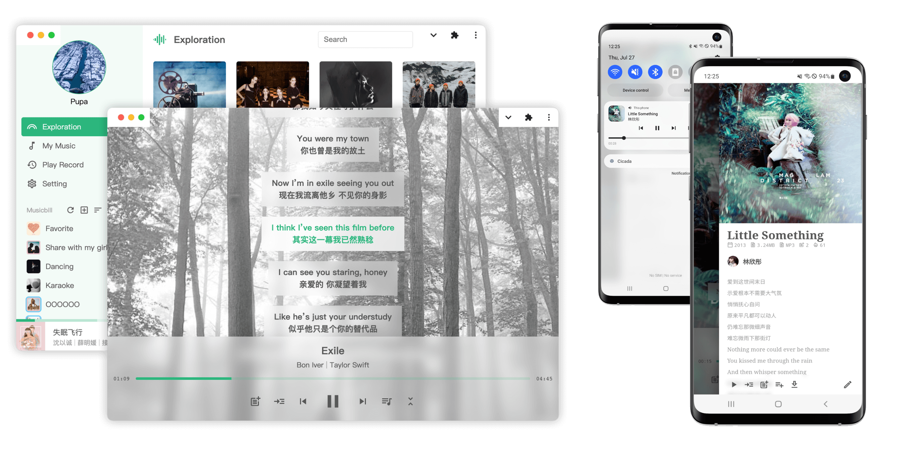

# Cicada

A multi-user music service for self-hosting.




## Feature

- No collection of privacy
- Multiple users
- Shared musicbill between users
- Support of importing music and music directory
- [PWA](https://developer.mozilla.org/docs/Web/Progressive_web_apps) supports both desktop and mobile
- Separation of playlist and custom playqueue
- Search of music, singer, musicbill and lyric
- [System media shortcut](https://developer.mozilla.org/docs/Web/API/MediaSession)
- Support of building APP from [HTTP API](./apps/pwa/src/server)
- Support of Two-Factor Authentication

## Deployment

You can deploy cicada by under options, and initial user of cicada is `username:cicada/password:cicada`.

### Binary

Download from [releases](https://github.com/mebtte/cicada/releases) and start server:

> If your platform isn't x64, you can [build](./docs/build/index.md) by yourself

```sh
./cicada start
```

Now cicada is available on `localhost:8000` or `{{ip}}:8000`. You can get more options by running `cicada start -h` or `cicada -h`.

### Docker

```sh
docker run \
  -d \
  --restart=always \
  -p 80:8000 \
  -v <data>:/data \
  --name cicada \
  mebtte/cicada:v2 \
  start --port 8000 --data /data
```

You can use `--user {uid}:{gid}` to map user.

### Docker Compose

```yml
services:
  cicada:
    restart: always
    container_name: cicada
    image: mebtte/cicada:v2

    # user mapping
    # user: 1000:1000

    command: start --port 8000 --data /data
    ports:
      - 80:8000
    volumes:
      - /path/data:/data
```

### Source Code

When using source code to deploy, you should install [Node>=18](https://nodejs.org) first.

```sh
git clone https://github.com/mebtte/cicada.git
cd cicada
npm ci
npm run build:pwa
npm start -- -- start --port <port> --data <data> # attention: double --
```

When needing to upgrade, you should run below commands:

```sh
git pull # pull the latest code
npm run build:pwa # rebuild pwa
npm start -- -- start --port <port> --data <data> # restart the server
```

## Migration

### From v1 to v2

If you migrate to v2 from v1, you must upgrade data before serving:

#### Binary

```sh
cicada upgrade-data <data>
```

#### Docker:

```sh
docker run -it --rm -v <data>:/data mebtte/cicada:v2 upgrade-data /data
```

#### Source Code

```sh
npm start -- -- upgrade-data <data>
```

#### Other versions

- [From v0 to v1](https://github.com/mebtte/cicada/tree/v1#from-v0-to-v1)

## Import music

You can use `cicada import` to import music file and music directory, but the filename must to fit the below format:

```txt
singer1[,singer2][,singer3] - name.format
```

For example, `Jarryd James,BROODS - 1000x.flac` / `周杰伦 - 晴天.mp3` is valid and `Numb.m4a` / `Daniel Powter Free Loop.mp3` is invalid, the file has invalid filename will be passed when importing.

### Binary

```sh
# import direcoty
cicada import --data /path_to/cicada_data --recursive <music_directory>

# import file
cicada import --data /path_to/cicada_data <music>
```

### Docker

```sh
# import directory
docker run -it --rm -v <data>:/data mebtte/cicada:v2 -v <music_directory>:/source import --data /path_to/cicada_data --recursive /source

# import file
docker run -it --rm -v <data>:/data mebtte/cicada:v2 -v <music_directory>:/source import --data /path_to/cicada_data --recursive /source/<music>
```

### Source Code

```sh
# import directory
npm start -- -- import --data /path_to/cicada_data --recursive <music_directory>

# import file
npm start -- -- import --data /path_to/cicada_data <music>
```

## Fix data

According to known issues, some old versions of cicada will breakdown the data, you can fix it by using below command:

```sh
cicada fix-data <data>
```

This command is unharmful, so you can run it even the data isn't broken. Also can run the command by docker or source code:

```sh
docker run -it --rm -v <data>:/data mebtte/cicada:v2 fix-data /data
```

```sh
npm start -- -- fix-data <data>
```

## Development

Cicada is a **monorepo** that contains two sub-projects under the `apps` directory. `cli` is for the server, which is used to manage assets and start services. `pwa` is for the client, which is used to access for users. And there is a `shared` directory on the root, which contains the code runs on both `cli` and `pwa`.

If you want to develop or contribute, **most of cicada is developed by TS/JS** and you should know it. Cicada relies on [Node>=18](https://nodejs.org) and you should install it on your device first.

Clone the project:

```sh
git clone https://github.com/mebtte/cicada.git
```

Install the dependencies:

```sh
npm install
```

Use commands of cicada CLI:

```sh
npm start -- -- <command> <options> <argument>
```

Before developing PWA, you should start dev server first:

```sh
CICADA_DATA=<data> npm run dev:server
# CICADA_DATA is the directory of data
```

Modify the code of `cli` and the cicada server will restart automatically. Then open another terminal window and start the pwa server:

```sh
npm run dev:pwa
```

Visit `localhost:8001` and use `http://localhost:8000` as server address, modify the code of `pwa` and you will see the change after auto reload.

## Q & A

<details>
  <summary>How to migrate data?</summary>

All of data is under `{{data}}` directory, copy or move it to new device.

</details>

<details>
  <summary>How to login if I forget the password ?</summary>

1. If you are a normal user, you should contact the admin and let him/her help you to change the password. Above operation will also disable 2FA for your account.
2. If you are an admin, you can let other admins help you to change the password or update the sqlite database using below SQL:

```sql
UPDATE user SET password = <md5<md5<password>>> WHERE username = <username>;
UPDATE user SET twoFASecret = NULL WHERE username = <username>;
```

</details>

<details>
  <summary>Why can't play next music on iOS/iPadOS automatically ?</summary>

Because compatibility of PWA is broken on iOS/iPadOS, there is a plan to develop a App for iOS/iPadOS but it is uncertain.

</details>

## Contributor

<a href="https://github.com/mebtte/cicada/graphs/contributors">
  
</a>

## License

[GPL](./license)
