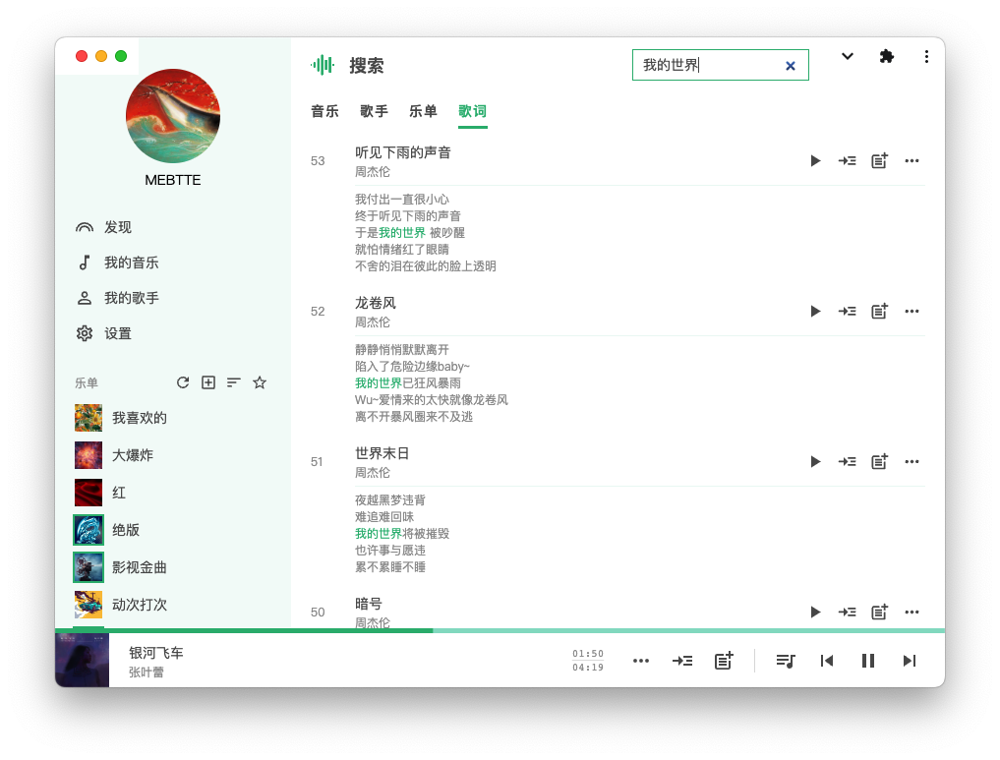
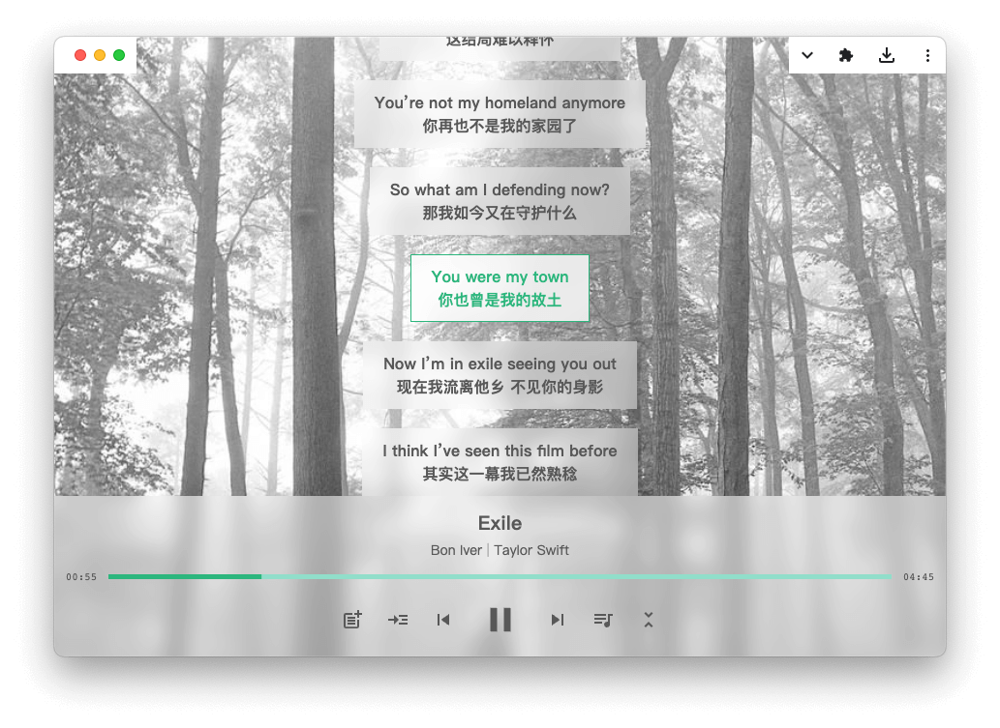

# 知了

知了, 一个支持多用户的自主托管音乐服务.




## 准备

- 邮箱账号, 用于发送邮件

## 部署

新建配置文件 `config.json`:

```json
{
  "emailHost": "smtp.example.com",
  "emailUser": "example",
  "emailPass": "example-password"
}
```

> 因为知了依赖邮箱验证码进行登录, 以及部分功能需要依赖邮箱实现, 所以需要邮箱服务进行邮件发送.

> 完整配置可以参看[配置项](./docs/config/index.md).

在 [Releases](https://github.com/mebtte/cicada/releases) 下载并解压对应平台的二进制包, 通过下面命令指定配置文件并启动(以 x64 Linux 为例):

```sh
./cicada-linux-x64 start -c config.json
```

通过 `localhost:8000` 或者 `ip:8000` 访问知了服务.

目前只提供了几种主流平台的构建包, 其他平台可以参考[构建文档](./docs/build/index.md)自行构建.

## 更多

- [使用说明](./docs//pwa_usage/index.md)
- [更新版本](./docs/migration/index.md)
- [常见问题](./docs/qa/index.md)

## 开源协议

[GPL](./license)
