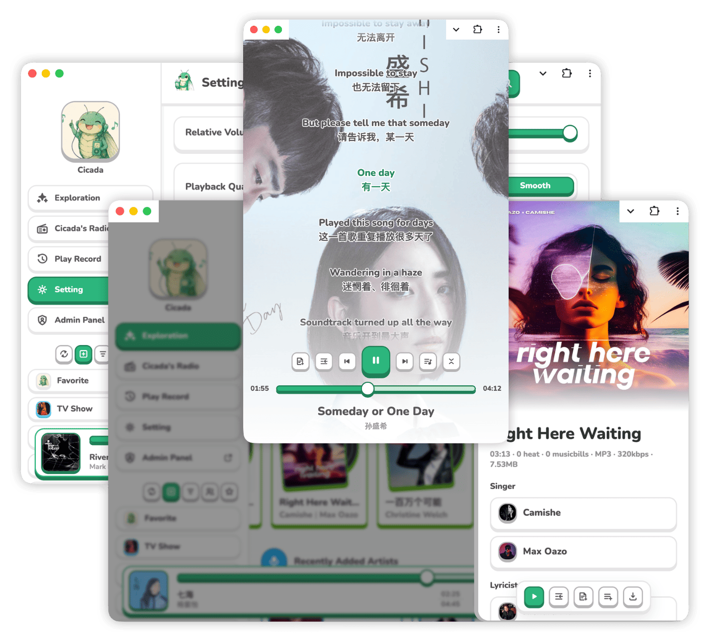

#  Cicada

A multi-user music service for self-hosting.




## Demo

There is an online demo you can visit on [https://cicada.mebtte.com](https://cicada.mebtte.com), you can login by `username: cicada` and `password: cicada@mebtte`.

## Features

- **No privacy collection** and manage data by yourself
- Single-binary deployment with embedded PWA assets and bundled
  `ffmpeg`/`ffprobe`
- Custom playqueue and share musicbills between users
- Multiple user and support 2FA
- Support lyricist and composer

## Deploy

> If you use docker, see this [docs](./docs/docker_deployment/index.md).

Download the archive for your platform from
[GitHub Releases](https://github.com/mebtte/cicada/releases). Extract and start the server:

```sh
./cicada start --data /path/to/cicada_data --port 8000
```

On Windows, use `cicada.exe`:

```powershell
.\cicada.exe start --data C:\path\to\cicada_data --port 8000
```

On the first startup, Cicada creates a default user and prints `username`/`password` to the log. After startup, you can visit cicada on `http://localhost:8000`.

## Development

If you are interested in developing `cicada`, see the development [docs](./docs/development/index.md).

## License

[GPL](./license)

## Star History

[](https://star-history.com/#mebtte/cicada&Date)
